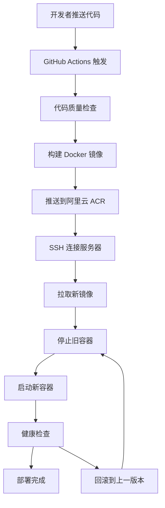

# 🚀 宇宙探索者 - 现代化部署方案总览

## 📋 方案概述

本项目采用 **CI/CD + GitHub + Docker + 阿里云** 的现代化部署架构，实现了从代码提交到生产部署的全自动化流程。

### 🏗️ 架构图

```
开发者 → GitHub → GitHub Actions → 阿里云 ACR → 阿里云 ECS → 用户访问
  ↓         ↓           ↓              ↓           ↓
代码推送   自动构建    Docker镜像     容器部署    应用服务
```

## 🎯 核心优势

- ✅ **零人工干预**: 推送代码即自动部署
- ✅ **环境一致性**: Docker 确保开发、测试、生产环境完全一致
- ✅ **快速回滚**: 出问题时秒级回滚到上一版本
- ✅ **高可用性**: 健康检查、自动重启、负载均衡
- ✅ **成本优化**: 按需扩容、资源监控、自动清理
- ✅ **安全可靠**: 镜像扫描、访问控制、数据备份

## 📁 项目文件结构

```
cosmos-explorer/
├── 📋 部署文档
│   ├── 部署实施指南.md          # 详细的部署实施文档
│   ├── 快速开始指南.md          # 30分钟快速部署指南
│   ├── DEPLOYMENT.md           # 英文部署文档
│   └── README-部署方案.md       # 本文档
│
├── 🐳 Docker 配置
│   ├── Dockerfile              # 多阶段构建配置
│   ├── docker-compose.yml      # 开发环境配置
│   ├── docker-compose.prod.yml # 生产环境配置
│   └── nginx.conf              # Nginx 配置
│
├── 🔧 自动化脚本
│   ├── scripts/
│   │   ├── server-setup.sh     # 服务器环境一键安装
│   │   ├── deploy-aliyun.sh    # 阿里云部署脚本
│   │   ├── ssh-setup.sh        # SSH 密钥配置
│   │   ├── health-check.sh     # 健康检查脚本
│   │   └── monitor.sh          # 实时监控脚本
│   └── Makefile                # 常用命令集合
│
├── 🚀 CI/CD 配置
│   └── .github/workflows/
│       └── deploy.yml          # GitHub Actions 工作流
│
└── ⚙️ 环境配置
    └── .env.example            # 环境变量示例
```

## 🚀 快速开始

### 方式一：30分钟快速部署 (推荐新手)

```bash
# 1. 查看快速指南
cat 快速开始指南.md

# 2. 一键设置服务器环境
./scripts/server-setup.sh

# 3. 配置 SSH 密钥
./scripts/ssh-setup.sh generate your-email@example.com

# 4. 推送代码触发部署
git push origin main
```

### 方式二：使用 Makefile (推荐开发者)

```bash
# 查看所有可用命令
make help

# 快速启动本地环境
make quick-start

# 部署到生产环境
make deploy-prod

# 监控应用状态
make monitor
```

### 方式三：手动部署 (推荐运维)

```bash
# 1. 查看详细指南
cat 部署实施指南.md

# 2. 按步骤执行部署
# (详见部署实施指南.md)
```

## 📊 部署方案对比

| 方案 | 适用场景 | 优势 | 时间成本 |
|------|----------|------|----------|
| **CI/CD + Docker** | 生产环境 | 自动化、可靠性高 | 初次30分钟，后续0分钟 |
| 传统 FTP 上传 | 简单项目 | 操作简单 | 每次10分钟 |
| 服务器直接构建 | 小型项目 | 无需 Docker | 每次15分钟 |
| Vercel/Netlify | 静态网站 | 零配置 | 5分钟 |

## 🛠️ 核心组件说明

### 1. GitHub Actions (CI/CD)
- **作用**: 自动化构建、测试、部署
- **触发**: 代码推送到 main/develop 分支
- **流程**: 代码检查 → 构建镜像 → 推送到 ACR → 部署到服务器

### 2. 阿里云 ACR (容器镜像仓库)
- **作用**: 存储和分发 Docker 镜像
- **优势**: 国内访问速度快、安全可靠
- **成本**: 个人版免费 1GB 存储

### 3. Docker (容器化)
- **作用**: 应用容器化，确保环境一致性
- **优势**: 快速部署、易于扩展、资源隔离
- **配置**: 多阶段构建，优化镜像大小

### 4. 阿里云 ECS (云服务器)
- **推荐配置**: 2核4GB，Ubuntu 20.04
- **成本**: 约 ¥100/月
- **用途**: 运行 Docker 容器

## 📈 部署流程详解

### 自动化部署流程



### 环境管理

- **开发环境**: `develop` 分支 → 自动部署到开发服务器
- **生产环境**: `main` 分支 → 自动部署到生产服务器
- **版本发布**: 创建 tag → 触发生产部署

## 🔧 常用操作

### 日常开发

```bash
# 启动开发环境
make dev

# 代码检查和格式化
make lint format

# 运行测试
make test

# 提交代码（自动检查）
make commit
```

### 部署管理

```bash
# 查看应用状态
make status

# 查看实时日志
make logs

# 执行健康检查
make health-check

# 启动监控面板
make monitor
```

### 故障处理

```bash
# 生成健康报告
make health-report

# 性能测试
make performance

# 备份应用
make backup

# 清理资源
make clean-docker
```

## 📊 监控和告警

### 实时监控

- **应用状态**: 容器运行状态、健康检查
- **系统资源**: CPU、内存、磁盘使用率
- **网络状态**: 端口监听、外网连通性
- **应用日志**: 错误日志统计和分析

### 告警机制

- **邮件告警**: 系统异常时发送邮件通知
- **Slack 通知**: 集成 Slack 实时通知
- **自动修复**: 容器异常时自动重启

## 🔒 安全措施

### 访问控制

- **SSH 密钥**: 使用密钥认证，禁用密码登录
- **防火墙**: 只开放必要端口 (22, 80, 443)
- **容器隔离**: 应用运行在独立容器中

### 数据安全

- **定期备份**: 自动备份 Docker 镜像和数据
- **镜像扫描**: 使用 Trivy 扫描安全漏洞
- **访问日志**: 记录所有访问和操作日志

## 💰 成本分析

### 阿里云成本 (月)

- **ECS 服务器**: ¥100 (2核4GB)
- **ACR 镜像仓库**: ¥0 (个人版免费)
- **带宽流量**: ¥20 (5Mbps)
- **总计**: ≈ ¥120/月

### 时间成本

- **初次部署**: 30分钟
- **日常部署**: 0分钟 (全自动)
- **维护时间**: 每周10分钟

### ROI 分析

- **传统部署**: 每次15分钟 × 每周3次 = 45分钟/周
- **自动化部署**: 每周10分钟维护
- **时间节省**: 78% ↑

## 🎯 最佳实践

### 开发流程

1. **功能开发**: 在 `feature/*` 分支开发
2. **测试验证**: 合并到 `develop` 分支测试
3. **生产发布**: 合并到 `main` 分支发布
4. **版本标记**: 创建 tag 标记版本

### 部署策略

1. **蓝绿部署**: 新旧版本并存，快速切换
2. **滚动更新**: 逐步替换容器，零停机部署
3. **金丝雀发布**: 小流量验证，逐步放量

### 监控策略

1. **主动监控**: 定时健康检查
2. **被动告警**: 异常时立即通知
3. **性能分析**: 定期性能测试

## 🔮 未来规划

### 短期目标 (1-3个月)

- [ ] 集成 Prometheus + Grafana 监控
- [ ] 配置 ELK 日志分析
- [ ] 实现多环境管理 (dev/staging/prod)
- [ ] 添加自动化测试覆盖率

### 中期目标 (3-6个月)

- [ ] 实现 Kubernetes 部署
- [ ] 配置 CDN 加速
- [ ] 实现数据库备份策略
- [ ] 添加性能监控告警

### 长期目标 (6-12个月)

- [ ] 多地域部署
- [ ] 微服务架构改造
- [ ] 实现 DevSecOps
- [ ] 智能运维平台

## 📞 技术支持

### 文档资源

- [部署实施指南.md](./部署实施指南.md) - 详细部署步骤
- [快速开始指南.md](./快速开始指南.md) - 30分钟快速上手
- [DEPLOYMENT.md](./DEPLOYMENT.md) - 英文部署文档

### 常用命令

```bash
# 查看所有可用命令
make help

# 查看项目状态
make status

# 获取帮助
./scripts/health-check.sh --help
./scripts/monitor.sh help
```

### 联系方式

- **技术支持**: tech@cosmos-explorer.com
- **文档反馈**: docs@cosmos-explorer.com
- **GitHub Issues**: https://github.com/your-username/cosmos-explorer/issues

---

**🌌 让我们一起探索宇宙的奥秘，用现代化的技术构建未来！** ✨
