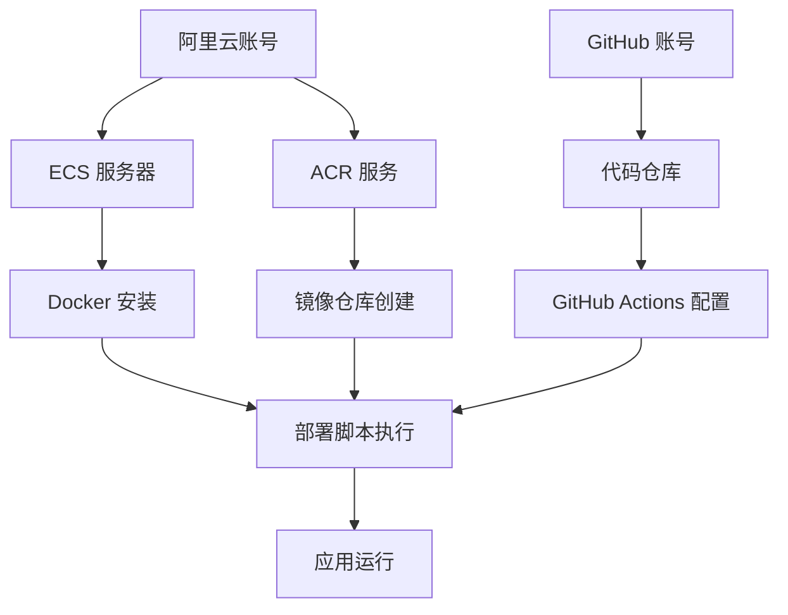

# 🚀 宇宙探索者项目 - 完整部署实施指南

## 📖 目录
1. [部署方案概述](#部署方案概述)
2. [传统部署 vs Docker 化部署对比](#传统部署-vs-docker-化部署对比)
3. [阿里云 ACR 详细说明](#阿里云-acr-详细说明)
4. [完整部署流程](#完整部署流程)
5. [服务器环境准备](#服务器环境准备)
6. [阿里云服务配置](#阿里云服务配置)
7. [GitHub 配置](#github-配置)
8. [部署执行](#部署执行)
9. [验证和监控](#验证和监控)
10. [故障排除](#故障排除)
11. [维护和更新](#维护和更新)

---

## 🎯 部署方案概述

### 什么是我们的部署方案？

我们采用的是 **CI/CD + GitHub + Docker + 阿里云** 的现代化部署方案：

```
开发者推送代码 → GitHub Actions 自动构建 → 打包成 Docker 镜像 → 推送到阿里云 ACR → 自动部署到服务器
```

### 核心组件说明

- **GitHub Actions**: 自动化构建和部署工具
- **Docker**: 容器化技术，确保环境一致性
- **阿里云 ACR**: 容器镜像仓库，存储 Docker 镜像
- **阿里云 ECS**: 云服务器，运行我们的应用

---

## 🔄 传统部署 vs Docker 化部署对比

### 传统部署方式的痛点

#### 1. 手动上传文件方式
```bash
# 传统方式：每次都要手动操作
scp -r dist/* user@server:/var/www/html/
ssh user@server "systemctl restart nginx"
```

**问题：**
- ❌ 每次部署都需要手动操作，容易出错
- ❌ 环境不一致（开发环境 vs 生产环境）
- ❌ 难以回滚到上一版本
- ❌ 无法自动化测试
- ❌ 部署过程中可能导致服务中断

#### 2. 直接在服务器构建方式
```bash
# 传统方式：在服务器上直接构建
ssh user@server
cd /var/www/project
git pull origin main
npm install
npm run build
systemctl restart nginx
```

**问题：**
- ❌ 服务器需要安装 Node.js、npm 等开发工具
- ❌ 构建过程占用服务器资源
- ❌ 构建失败会影响线上服务
- ❌ 难以管理多个版本

### Docker 化部署的优势

#### 1. 环境一致性
```bash
# Docker 方式：环境完全一致
# 开发环境、测试环境、生产环境使用相同的 Docker 镜像
docker run -p 80:80 cosmos-explorer:v1.0.0
```

**优势：**
- ✅ "在我机器上能跑" 问题彻底解决
- ✅ 开发、测试、生产环境完全一致
- ✅ 新团队成员快速上手

#### 2. 自动化部署
```bash
# 只需推送代码，其他全自动
git push origin main
# GitHub Actions 自动：构建 → 测试 → 打包 → 部署
```

**优势：**
- ✅ 零人工干预，减少人为错误
- ✅ 自动运行测试，确保代码质量
- ✅ 部署过程标准化、可重复

#### 3. 快速回滚
```bash
# 出问题时，秒级回滚到上一版本
docker stop cosmos-explorer-current
docker run -d --name cosmos-explorer-current cosmos-explorer:v0.9.0
```

**优势：**
- ✅ 秒级回滚，最小化服务中断
- ✅ 版本管理清晰
- ✅ 可以同时运行多个版本进行 A/B 测试

#### 4. 资源隔离
```bash
# 每个应用运行在独立的容器中
docker run --memory=512m --cpus=1.0 cosmos-explorer
```

**优势：**
- ✅ 应用之间相互隔离，不会互相影响
- ✅ 资源使用可控，防止某个应用占用过多资源
- ✅ 安全性更高

---

## 🏗️ 阿里云 ACR 详细说明

### 什么是阿里云 ACR？

**阿里云容器镜像服务 (Alibaba Cloud Container Registry, ACR)** 是阿里云提供的 Docker 镜像托管服务，类似于 Docker Hub，但针对中国用户优化。

### 为什么需要 ACR？

#### 1. 镜像存储和分发
```bash
# 没有 ACR 的情况：
# 每次部署都需要在服务器上重新构建镜像，耗时且占用服务器资源

# 有了 ACR：
# 在 GitHub Actions 中构建一次，推送到 ACR
# 服务器直接从 ACR 拉取现成的镜像，快速部署
docker pull registry.cn-hangzhou.aliyuncs.com/your-namespace/cosmos-explorer:latest
```

#### 2. 网络速度优化
```bash
# 使用 Docker Hub（国外）：下载速度慢，经常超时
docker pull nginx:alpine  # 可能需要 10+ 分钟

# 使用阿里云 ACR（国内）：下载速度快
docker pull registry.cn-hangzhou.aliyuncs.com/your-namespace/cosmos-explorer:latest  # 通常 1-2 分钟
```

#### 3. 版本管理
ACR 提供了完善的版本管理功能：
- 自动标签管理
- 镜像扫描（安全漏洞检测）
- 访问控制
- 镜像同步

### ACR 在我们部署流程中的作用


1. **构建阶段**: GitHub Actions 构建 Docker 镜像
2. **存储阶段**: 镜像推送到 ACR 保存
3. **部署阶段**: 服务器从 ACR 拉取镜像并运行

### ACR vs 其他方案对比

| 方案 | 优势 | 劣势 | 适用场景 |
|------|------|------|----------|
| 阿里云 ACR | 国内速度快、稳定、集成度高 | 需要阿里云账号 | 国内部署 |
| Docker Hub | 免费、生态丰富 | 国内访问慢、有限制 | 国外部署 |
| 自建 Registry | 完全控制 | 维护成本高 | 大型企业 |
| GitHub Packages | 与 GitHub 集成好 | 国内访问慢 | 开源项目 |

---

## 📋 完整部署流程

### 流程概览

```
第一阶段：环境准备 (30分钟)
├── 1. 购买阿里云 ECS 服务器
├── 2. 安装 Docker 和基础软件
├── 3. 配置阿里云 ACR
└── 4. 配置 GitHub Secrets

第二阶段：代码配置 (15分钟)
├── 1. 修改配置文件
├── 2. 提交代码到 GitHub
└── 3. 验证 GitHub Actions

第三阶段：部署执行 (10分钟)
├── 1. 触发自动部署
├── 2. 监控部署过程
└── 3. 验证部署结果

第四阶段：后续维护 (持续)
├── 1. 监控应用状态
├── 2. 日志查看
└── 3. 版本更新
```

### 依赖关系图



---

## 🖥️ 服务器环境准备

### 1. 购买阿里云 ECS 服务器

#### 推荐配置
- **实例规格**: ecs.t6-c1m2.large (2核4GB)
- **操作系统**: Ubuntu 20.04 LTS 或 CentOS 8
- **存储**: 40GB SSD
- **带宽**: 5Mbps
- **地域**: 根据用户群体选择（如华东1-杭州）

#### 购买步骤
1. 登录阿里云控制台
2. 选择 "云服务器 ECS"
3. 点击 "创建实例"
4. 按推荐配置选择
5. 设置登录密码
6. 完成购买

### 2. 连接服务器

```bash
# 使用 SSH 连接服务器（替换为你的服务器 IP）
ssh root@your-server-ip

# 首次连接会提示确认，输入 yes
# 然后输入你设置的密码
```

### 3. 更新系统

```bash
# Ubuntu 系统
sudo apt update && sudo apt upgrade -y

# CentOS 系统
sudo yum update -y
```

### 4. 安装必要软件

```bash
# 安装基础工具
sudo apt install -y curl wget git vim unzip

# 安装 Docker
curl -fsSL https://get.docker.com -o get-docker.sh
sudo sh get-docker.sh

# 启动 Docker 服务
sudo systemctl start docker
sudo systemctl enable docker

# 将当前用户添加到 docker 组（避免每次都用 sudo）
sudo usermod -aG docker $USER

# 重新登录或执行以下命令使组权限生效
newgrp docker

# 验证 Docker 安装
docker --version
docker run hello-world
```

### 5. 安装 Docker Compose

```bash
# 下载 Docker Compose
sudo curl -L "https://github.com/docker/compose/releases/download/v2.20.0/docker-compose-$(uname -s)-$(uname -m)" -o /usr/local/bin/docker-compose

# 添加执行权限
sudo chmod +x /usr/local/bin/docker-compose

# 验证安装
docker-compose --version
```

### 6. 配置防火墙

```bash
# Ubuntu 使用 ufw
sudo ufw allow 22    # SSH
sudo ufw allow 80    # HTTP
sudo ufw allow 443   # HTTPS
sudo ufw enable

# CentOS 使用 firewalld
sudo firewall-cmd --permanent --add-port=22/tcp
sudo firewall-cmd --permanent --add-port=80/tcp
sudo firewall-cmd --permanent --add-port=443/tcp
sudo firewall-cmd --reload
```

### 7. 创建项目目录

```bash
# 创建项目目录
sudo mkdir -p /opt/cosmos-explorer
sudo chown $USER:$USER /opt/cosmos-explorer
cd /opt/cosmos-explorer

# 创建必要的子目录
mkdir -p {logs,data,config,scripts}
```

---

## ☁️ 阿里云服务配置

### 1. 开通容器镜像服务 (ACR)

#### 步骤详解
1. **登录阿里云控制台**
   - 访问 https://ecs.console.aliyun.com
   - 使用你的阿里云账号登录

2. **开通 ACR 服务**
   ```bash
   # 在控制台搜索 "容器镜像服务"
   # 或直接访问：https://cr.console.aliyun.com
   ```

3. **选择服务版本**
   - **个人版**：免费，适合个人项目
   - **企业版**：付费，适合企业项目
   - 我们选择 **个人版** 即可

4. **设置访问凭证**
   ```bash
   # 在 ACR 控制台，点击 "访问凭证"
   # 设置 Registry 登录密码（记住这个密码，后面会用到）
   ```

### 2. 创建命名空间

```bash
# 在 ACR 控制台操作：
# 1. 点击 "命名空间"
# 2. 点击 "创建命名空间"
# 3. 输入命名空间名称：cosmos-explorer
# 4. 选择 "公开" 或 "私有"（推荐私有）
# 5. 点击 "确定"
```

### 3. 创建镜像仓库

```bash
# 在 ACR 控制台操作：
# 1. 点击 "镜像仓库"
# 2. 点击 "创建镜像仓库"
# 3. 填写信息：
#    - 命名空间：cosmos-explorer
#    - 仓库名称：cosmos-explorer
#    - 摘要：宇宙探索者项目
#    - 仓库类型：私有
# 4. 点击 "下一步"
# 5. 代码源：本地仓库
# 6. 点击 "创建镜像仓库"
```

### 4. 获取 ACR 信息

创建完成后，你会得到以下信息：
```bash
# 镜像仓库地址
registry.cn-hangzhou.aliyuncs.com/cosmos-explorer/cosmos-explorer

# 登录命令
docker login --username=你的阿里云账号 registry.cn-hangzhou.aliyuncs.com
```

### 5. 测试 ACR 连接

```bash
# 在你的服务器上测试
docker login --username=你的阿里云账号 registry.cn-hangzhou.aliyuncs.com
# 输入你在第1步设置的 Registry 密码

# 看到 "Login Succeeded" 表示成功
```

---

## 🐙 GitHub 配置

### 1. 创建 GitHub 仓库

如果还没有 GitHub 仓库：
```bash
# 在 GitHub 网站上创建新仓库
# 1. 访问 https://github.com
# 2. 点击 "New repository"
# 3. 仓库名：cosmos-explorer
# 4. 选择 "Private" 或 "Public"
# 5. 点击 "Create repository"
```

### 2. 推送代码到 GitHub

```bash
# 在你的项目目录中
git init
git add .
git commit -m "Initial commit"
git branch -M main
git remote add origin https://github.com/你的用户名/cosmos-explorer.git
git push -u origin main
```

### 3. 配置 GitHub Secrets

GitHub Secrets 是存储敏感信息的安全方式，如密码、API 密钥等。

#### 步骤详解
1. **进入仓库设置**
   - 在你的 GitHub 仓库页面
   - 点击 "Settings" 标签
   - 在左侧菜单找到 "Secrets and variables"
   - 点击 "Actions"

2. **添加 Secrets**
   点击 "New repository secret"，逐个添加以下 secrets：

```bash
# 阿里云访问密钥（在阿里云控制台 -> AccessKey 管理中获取）
ALIYUN_ACCESS_KEY_ID=LTAI5t...（你的 AccessKey ID）
ALIYUN_ACCESS_KEY_SECRET=xxx...（你的 AccessKey Secret）

# 阿里云 Docker 登录信息
ALIYUN_DOCKER_USERNAME=你的阿里云账号
ALIYUN_DOCKER_PASSWORD=你在ACR中设置的Registry密码

# 生产服务器信息
PROD_HOST=你的服务器IP地址
PROD_USERNAME=root
PROD_SSH_KEY=你的SSH私钥内容

# 开发服务器信息（如果有）
DEV_HOST=你的开发服务器IP
DEV_USERNAME=root
DEV_SSH_KEY=你的开发服务器SSH私钥

# 通知配置（可选）
SLACK_WEBHOOK_URL=你的Slack Webhook URL
```

#### 如何获取 SSH 私钥？

```bash
# 在你的本地电脑上生成 SSH 密钥对
ssh-keygen -t rsa -b 4096 -C "your-email@example.com"

# 查看公钥内容（需要添加到服务器）
cat ~/.ssh/id_rsa.pub

# 查看私钥内容（需要添加到 GitHub Secrets）
cat ~/.ssh/id_rsa
```

#### 将公钥添加到服务器

```bash
# 在服务器上执行
mkdir -p ~/.ssh
echo "你的公钥内容" >> ~/.ssh/authorized_keys
chmod 600 ~/.ssh/authorized_keys
chmod 700 ~/.ssh
```

### 4. 修改配置文件

#### 修改 GitHub Actions 配置

```bash
# 编辑 .github/workflows/deploy.yml
# 将以下内容替换为你的实际信息：

env:
  REGISTRY: registry.cn-hangzhou.aliyuncs.com  # 你的 ACR 地址
  IMAGE_NAME: cosmos-explorer
  NAMESPACE: cosmos-explorer  # 你创建的命名空间
```

#### 修改部署脚本

```bash
# 编辑 scripts/deploy-aliyun.sh
# 修改以下变量：

REGISTRY="registry.cn-hangzhou.aliyuncs.com"
NAMESPACE="cosmos-explorer"  # 你的命名空间
```

---

## 🚀 部署执行

### 1. 首次部署

#### 方法一：推送到 main 分支（自动部署）
```bash
# 确保所有配置文件都已修改并提交
git add .
git commit -m "配置部署环境"
git push origin main

# GitHub Actions 会自动开始构建和部署
```

#### 方法二：手动触发部署
```bash
# 在 GitHub 仓库页面
# 1. 点击 "Actions" 标签
# 2. 选择 "CI/CD Pipeline" 工作流
# 3. 点击 "Run workflow"
# 4. 选择分支（main）
# 5. 点击 "Run workflow"
```

### 2. 监控部署过程

#### 在 GitHub 上监控
```bash
# 1. 进入你的 GitHub 仓库
# 2. 点击 "Actions" 标签
# 3. 点击最新的工作流运行
# 4. 查看各个步骤的执行情况
```

#### 在服务器上监控
```bash
# 连接到服务器
ssh root@your-server-ip

# 查看 Docker 镜像拉取情况
docker images | grep cosmos-explorer

# 查看容器运行情况
docker ps

# 查看容器日志
docker logs cosmos-explorer-prod -f
```

### 3. 部署过程详解

#### 第一阶段：代码检查（约2分钟）
```bash
# GitHub Actions 执行：
# 1. 检出代码
# 2. 安装 Node.js 和 pnpm
# 3. 安装依赖
# 4. 运行 TypeScript 检查
# 5. 运行 ESLint 检查
# 6. 运行测试
# 7. 构建项目
```

#### 第二阶段：镜像构建（约3分钟）
```bash
# GitHub Actions 执行：
# 1. 设置 Docker Buildx
# 2. 登录阿里云 ACR
# 3. 构建 Docker 镜像
# 4. 推送镜像到 ACR
```

#### 第三阶段：部署到服务器（约2分钟）
```bash
# GitHub Actions 通过 SSH 在服务器执行：
# 1. 备份当前容器
# 2. 停止旧容器
# 3. 拉取新镜像
# 4. 启动新容器
# 5. 健康检查
# 6. 清理旧镜像
```

---

## ✅ 验证和监控

### 1. 验证部署成功

#### 基础验证
```bash
# 1. 检查容器是否运行
docker ps | grep cosmos-explorer

# 2. 检查应用是否响应
curl http://your-server-ip/health

# 3. 在浏览器中访问
# http://your-server-ip
```

#### 详细验证
```bash
# 检查容器详细信息
docker inspect cosmos-explorer-prod

# 检查容器资源使用情况
docker stats cosmos-explorer-prod

# 检查容器日志
docker logs cosmos-explorer-prod --tail 50
```

### 2. 性能监控

#### 应用性能
```bash
# 响应时间测试
curl -w "@curl-format.txt" -o /dev/null -s http://your-server-ip/

# 创建 curl-format.txt 文件
cat > curl-format.txt << EOF
     time_namelookup:  %{time_namelookup}\n
        time_connect:  %{time_connect}\n
     time_appconnect:  %{time_appconnect}\n
    time_pretransfer:  %{time_pretransfer}\n
       time_redirect:  %{time_redirect}\n
  time_starttransfer:  %{time_starttransfer}\n
                     ----------\n
          time_total:  %{time_total}\n
EOF
```

#### 系统资源监控
```bash
# 查看系统资源使用情况
htop

# 查看磁盘使用情况
df -h

# 查看内存使用情况
free -h

# 查看 Docker 资源使用
docker system df
```

### 3. 日志管理

#### 查看应用日志
```bash
# 实时查看日志
docker logs cosmos-explorer-prod -f

# 查看最近的日志
docker logs cosmos-explorer-prod --tail 100

# 查看特定时间段的日志
docker logs cosmos-explorer-prod --since "2024-08-04T10:00:00" --until "2024-08-04T11:00:00"
```

#### 日志轮转配置
```bash
# 编辑 Docker daemon 配置
sudo vim /etc/docker/daemon.json

# 添加日志配置
{
  "log-driver": "json-file",
  "log-opts": {
    "max-size": "10m",
    "max-file": "3"
  }
}

# 重启 Docker 服务
sudo systemctl restart docker
```

---

## 🔧 故障排除

### 1. 常见问题及解决方案

#### 问题1：GitHub Actions 构建失败

**症状：**
```bash
# 在 GitHub Actions 中看到红色的 ❌
Error: Process completed with exit code 1
```

**排查步骤：**
```bash
# 1. 查看具体错误信息
# 在 GitHub Actions 页面点击失败的步骤查看详细日志

# 2. 常见原因和解决方案：

# 原因A：依赖安装失败
# 解决：检查 package.json 中的依赖版本
pnpm install --frozen-lockfile

# 原因B：TypeScript 类型错误
# 解决：本地运行类型检查
pnpm type-check

# 原因C：测试失败
# 解决：本地运行测试
pnpm test

# 原因D：构建失败
# 解决：本地运行构建
pnpm build
```

#### 问题2：Docker 镜像推送失败

**症状：**
```bash
Error: failed to push: denied: requested access to the resource is denied
```

**解决方案：**
```bash
# 1. 检查 ACR 登录信息
docker login registry.cn-hangzhou.aliyuncs.com

# 2. 检查 GitHub Secrets 是否正确设置
# ALIYUN_DOCKER_USERNAME
# ALIYUN_DOCKER_PASSWORD

# 3. 检查命名空间和仓库名是否正确
# 在 ACR 控制台确认仓库地址
```

#### 问题3：服务器部署失败

**症状：**
```bash
# SSH 连接失败或容器启动失败
```

**排查步骤：**
```bash
# 1. 检查 SSH 连接
ssh root@your-server-ip

# 2. 检查 Docker 服务状态
sudo systemctl status docker

# 3. 检查防火墙设置
sudo ufw status

# 4. 检查端口占用
netstat -tlnp | grep :80

# 5. 手动拉取镜像测试
docker pull registry.cn-hangzhou.aliyuncs.com/cosmos-explorer/cosmos-explorer:latest
```

#### 问题4：应用无法访问

**症状：**
```bash
# 浏览器显示无法连接或 502 错误
```

**排查步骤：**
```bash
# 1. 检查容器是否运行
docker ps | grep cosmos-explorer

# 2. 检查容器日志
docker logs cosmos-explorer-prod

# 3. 检查端口映射
docker port cosmos-explorer-prod

# 4. 检查防火墙
sudo ufw status

# 5. 检查 nginx 配置
docker exec cosmos-explorer-prod nginx -t

# 6. 进入容器调试
docker exec -it cosmos-explorer-prod sh
curl localhost/health
```

### 2. 调试命令集合

#### Docker 相关
```bash
# 查看所有容器（包括停止的）
docker ps -a

# 查看镜像列表
docker images

# 删除停止的容器
docker container prune

# 删除未使用的镜像
docker image prune

# 查看 Docker 系统信息
docker system info

# 查看 Docker 事件
docker events

# 强制删除容器
docker rm -f container_name

# 查看容器内进程
docker exec container_name ps aux
```

#### 网络相关
```bash
# 检查端口监听
netstat -tlnp

# 检查网络连接
ss -tlnp

# 测试端口连通性
telnet your-server-ip 80

# 检查 DNS 解析
nslookup your-domain.com

# 测试网络延迟
ping your-server-ip
```

#### 系统相关
```bash
# 查看系统负载
uptime

# 查看内存使用
free -h

# 查看磁盘使用
df -h

# 查看系统日志
journalctl -f

# 查看进程树
pstree

# 查看文件句柄使用情况
lsof | wc -l
```

---

## 🔄 维护和更新

### 1. 日常维护任务

#### 每日检查
```bash
# 创建日常检查脚本
cat > /opt/cosmos-explorer/scripts/daily-check.sh << 'EOF'
#!/bin/bash

echo "=== 每日健康检查 $(date) ==="

# 检查容器状态
echo "1. 容器状态："
docker ps | grep cosmos-explorer

# 检查应用响应
echo "2. 应用健康检查："
curl -s http://localhost/health || echo "健康检查失败"

# 检查系统资源
echo "3. 系统资源："
echo "内存使用："
free -h | grep Mem
echo "磁盘使用："
df -h | grep -E "/$|/opt"

# 检查日志错误
echo "4. 错误日志检查："
docker logs cosmos-explorer-prod --since "24h" | grep -i error | tail -5

echo "=== 检查完成 ==="
EOF

chmod +x /opt/cosmos-explorer/scripts/daily-check.sh
```

#### 设置定时任务
```bash
# 添加到 crontab
crontab -e

# 添加以下行（每天上午9点执行检查）
0 9 * * * /opt/cosmos-explorer/scripts/daily-check.sh >> /var/log/cosmos-daily-check.log 2>&1
```

### 2. 版本更新流程

#### 自动更新（推荐）
```bash
# 1. 在本地开发新功能
git checkout -b feature/new-feature
# 开发代码...
git add .
git commit -m "添加新功能"

# 2. 合并到 develop 分支（部署到开发环境）
git checkout develop
git merge feature/new-feature
git push origin develop

# 3. 测试通过后，合并到 main 分支（部署到生产环境）
git checkout main
git merge develop
git push origin main

# 4. 创建版本标签
git tag v1.1.0
git push origin v1.1.0
```

#### 手动更新
```bash
# 在服务器上手动更新
cd /opt/cosmos-explorer

# 备份当前版本
docker tag cosmos-explorer:latest cosmos-explorer:backup-$(date +%Y%m%d)

# 拉取新版本
docker pull registry.cn-hangzhou.aliyuncs.com/cosmos-explorer/cosmos-explorer:latest

# 停止旧容器
docker stop cosmos-explorer-prod

# 启动新容器
docker run -d \
  --name cosmos-explorer-prod \
  -p 80:80 \
  --restart unless-stopped \
  cosmos-explorer:latest

# 验证新版本
curl http://localhost/health
```

### 3. 备份策略

#### 镜像备份
```bash
# 创建备份脚本
cat > /opt/cosmos-explorer/scripts/backup.sh << 'EOF'
#!/bin/bash

BACKUP_DIR="/opt/cosmos-explorer/backups"
DATE=$(date +%Y%m%d-%H%M%S)

mkdir -p $BACKUP_DIR

# 备份当前运行的镜像
docker save cosmos-explorer:latest | gzip > $BACKUP_DIR/cosmos-explorer-$DATE.tar.gz

# 保留最近7天的备份
find $BACKUP_DIR -name "cosmos-explorer-*.tar.gz" -mtime +7 -delete

echo "备份完成: cosmos-explorer-$DATE.tar.gz"
EOF

chmod +x /opt/cosmos-explorer/scripts/backup.sh
```

#### 配置文件备份
```bash
# 备份重要配置文件
tar -czf /opt/cosmos-explorer/backups/config-$(date +%Y%m%d).tar.gz \
  /opt/cosmos-explorer/docker-compose.yml \
  /opt/cosmos-explorer/nginx.conf \
  /opt/cosmos-explorer/scripts/
```

### 4. 性能优化

#### 镜像优化
```bash
# 查看镜像大小
docker images | grep cosmos-explorer

# 分析镜像层
docker history cosmos-explorer:latest

# 清理构建缓存
docker builder prune
```

#### 容器优化
```bash
# 限制容器资源使用
docker update --memory=512m --cpus=1.0 cosmos-explorer-prod

# 查看容器资源使用情况
docker stats cosmos-explorer-prod
```

#### 系统优化
```bash
# 清理系统缓存
sudo apt clean
sudo apt autoremove

# 清理 Docker 资源
docker system prune -a

# 优化内核参数（可选）
echo 'vm.swappiness=10' | sudo tee -a /etc/sysctl.conf
sudo sysctl -p
```

---

## 📞 总结

通过这份详细的部署实施指南，你现在应该能够：

1. ✅ 理解 Docker 化部署相比传统部署的优势
2. ✅ 了解阿里云 ACR 的作用和配置方法
3. ✅ 完成从零开始的完整部署流程
4. ✅ 掌握日常维护和故障排除技能
5. ✅ 实现自动化的 CI/CD 部署流程

### 关键优势回顾

- **自动化程度高**: 推送代码即部署，零人工干预
- **环境一致性**: 开发、测试、生产环境完全一致
- **快速回滚**: 出问题时秒级回滚
- **易于维护**: 标准化的部署和维护流程
- **成本效益**: 减少运维成本，提高开发效率

### 下一步建议

1. **监控告警**: 配置 Prometheus + Grafana 监控
2. **日志分析**: 集成 ELK 或阿里云日志服务
3. **安全加固**: 配置 HTTPS、WAF 等安全措施
4. **性能优化**: CDN 加速、数据库优化等
5. **灾备方案**: 多地域部署、数据备份策略

如果在实施过程中遇到任何问题，可以参考故障排除章节，或者查看 GitHub Actions 的详细日志进行调试。

祝你部署顺利！🚀
